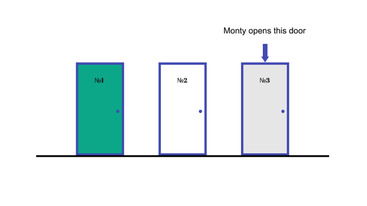
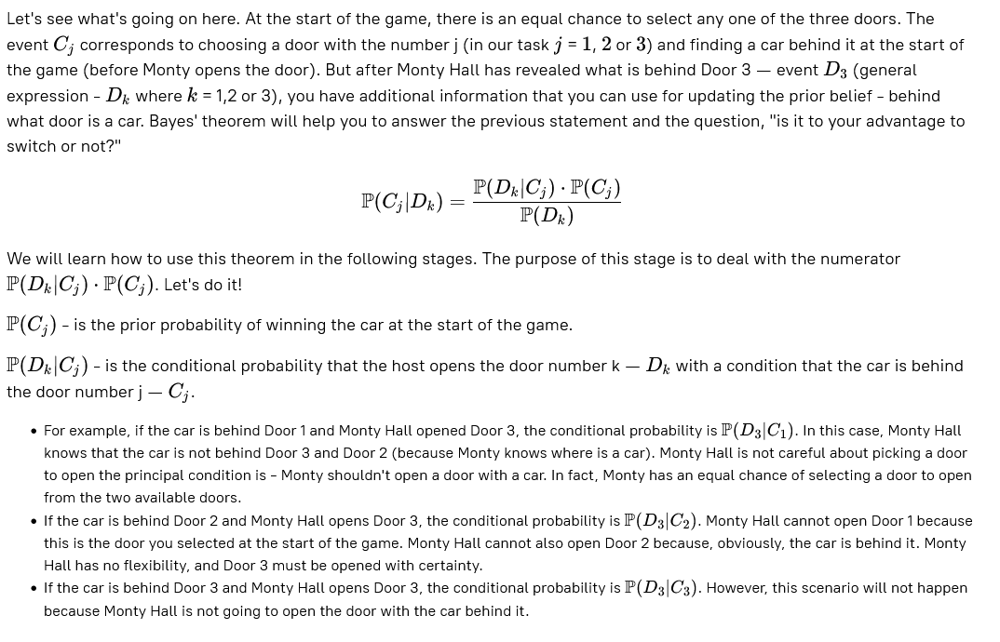

# Monty Hall Problem. Stage 1/5
## Probability of choice
### Description
Imagine you are on a game show where you must pick a door out of three identical ones to win a prize. Behind one of the  
doors is a car, behind the other two doors is a goat. The game host, Monty Hall, asks you to select a door. You pick Door 1,  
and Monty Hall, who knows what is behind all the doors, opens Door 3 revealing a goat. Monty Hall allows you to change your  
choice to Door 2. Is it to your advantage or not?

Let's see what's going on here.

### Objectives
The objective of this stage is to derive the prior probabilities, **P(C1)**, **P(C2)**, **P(C3)**, and the conditional  
probabilities **P(D3∣C1)**, **P(D3∣C2)**, **P(D3∣C3)**.

### Examples
_If you think that:_
P(C1)=50/100,  
P(C2)=25/100,  
P(C3)=1/4,  
P(D3∣C1)=0/100,  
P(D3∣C2)=3/9, and  
P(D3∣C3)=2/3

_Enter the probability values for the following (in reduced fraction):_
**P(C1)**, **P(C2)**, **P(C3)**, **P(D3∣C1)**, **P(D3∣C2)**, **P(D3∣C3)**