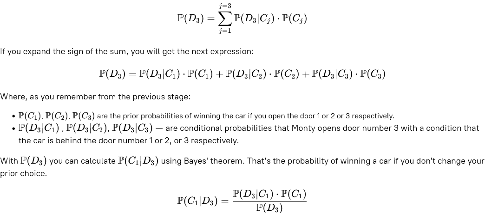

# Monty Hall Problem. Stage 2/5
## Stay as a rock
### Description
In the previous stage, you successfully figured out the prior probability of winning the car **P(Cj)** and the conditional  
probability **P(Dk∣Cj)**. In this stage, consider the probability of Monty opening a door number k — **P(Dk)**. After that,  
you will be ready to evaluate the probability of winning a car if you don't change a door.

According to the "Law of Total Probability", you can rewrite the probability of Monty opening door number 3 in the following way:

### Objectives
The objective of this stage is to derive the probabilities **P(D3)** and **P(C1∣D3)**.

### Examples
_If you think that:_

P(D3)=2/6 and P(C1∣D3)=2/8

_Enter the probability values for the following (in reduced fraction):_

P(D3), P(C1∣D3)