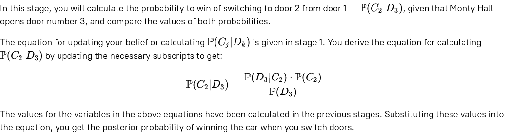

# Monty Hall Problem. Stage 3/5
## Stay calm and change the door
### Description
Now you know the probability to win a car if you don't switch your initial guess of the door. What will happen if you change the door?

### Objectives
The objective of this stage is to derive the probability **P(C2∣D3)**, and tell if switching is better by comparing the  
probabilities with that of not switching.

### Examples
_If you think that:_  

P(C2∣D3) = 20/50, and you prefer to switch from Door 1 to Door 2

_Enter the probability values for the following (in reduced fraction) and whether to switch or not as Yes/No:_  

P(C2∣D3), Is it better to switch?