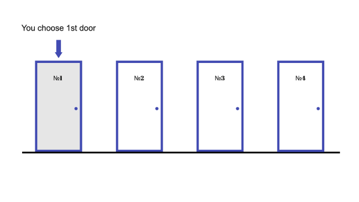
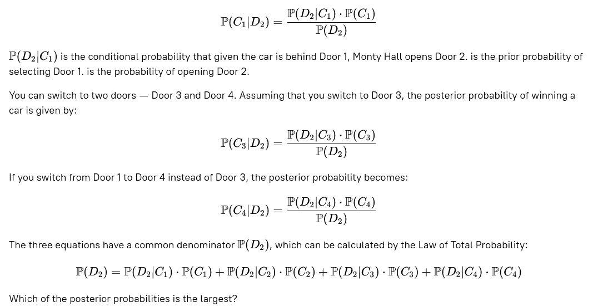

# Monty Hall Problem. Stage 4/5
## One more door
### Description
You've developed the intuition behind the classic three-door Monty Hall problem in the previous stages.  
In this stage, you will solve a variant of the Monty Hall problem with four doors.

You are on the same game show, but this time with four doors. You choose Door 1, and Monty Hall opens only one door, Door 2.  
Monty Hall now asks you whether you want to switch doors to Door 3 or Door 4. Is it to your advantage to change?  
Is there any advantage to switching to one door over another?

Let's assume that you do not switch; the posterior probability of finding a car behind door 1 is given by:

### Objectives
The objective of this stage is to calculate the probabilities of winning a car in the 4-Door variant of the Monty Hall
problem:
* P(D2)
* P(C1∣D2) in case of not switching
* P(C3∣D2) in case of switching to Door 3
* P(C4∣D2) in case of switching to Door 4

### Examples
_If you think that:_
P(D2)=9/16, P(C1∣D2)=1/2, P(C3∣D2)=3/4, and P(C4∣D2)=1/3

_Enter the probability values for the following (in reduced fraction):_
P(D2), P(C1∣D2), P(C3∣D2), P(C4∣D2)