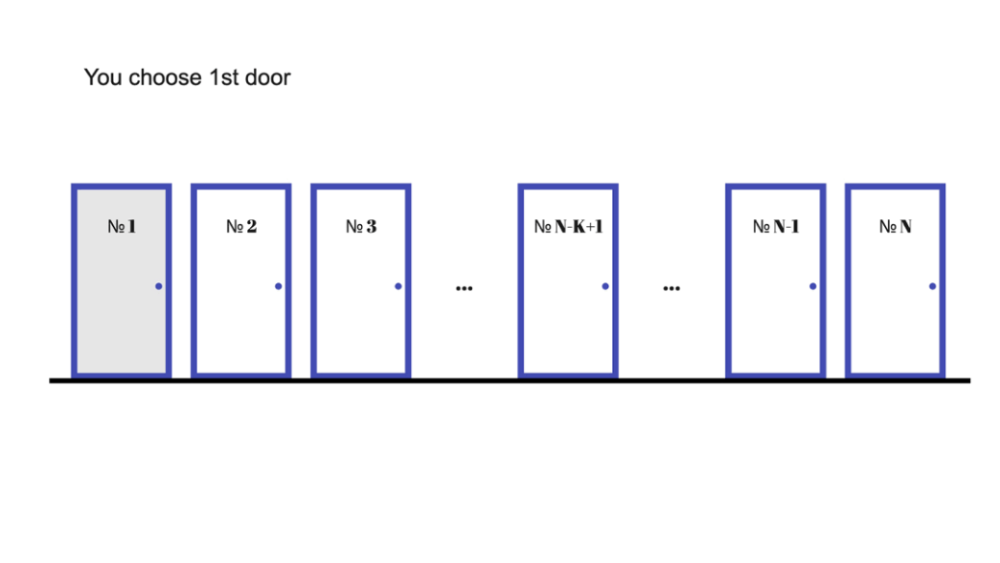
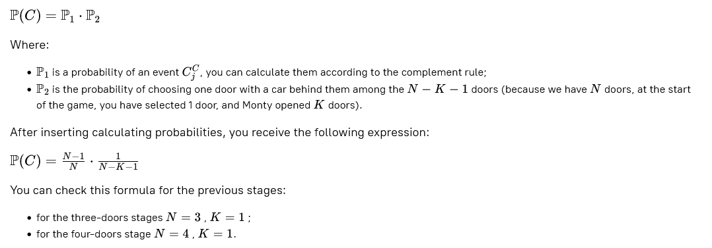
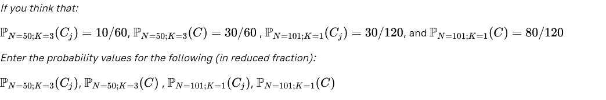

# Monty Hall Problem. Stage 5/5

## Nerves of steel

### Description

Previously, we participated in the Monty Hall show with three and four doors. In both cases, Monty Hall opened only one door.  
In this stage, we will consider the case when we have an unknown number of doors — **N**, and Monty opens **K** doors without  
the car **0 ≤ K ≤ N−2**. You can see that **K** can be equal to **0**, which means that Monty Hall doesn't choose any door.  
Moreover, it couldn't be more or equal to **N** because we have only **N** doors, and we had chosen one door before Monty chose doors.  
It also couldn't be equal to **N−1**, because in this case, all doors are opened, and we don't have an opportunity to switch doors.  
Also, Monty couldn't choose the door we had selected at the game's start. Let's show Monty Hall that this idea won't help  
him make it harder to select a contestant.

In this stage, you have to determine the formulas by which you can find out the probability of choosing the door with the 
car behind it without switching it and after switching.

At the start of the game, we have equal chances to choose a door and find a car behind them. It means your probability of  
winning a car without switching a door is **P(Cj)=1/N**. What are our chances win the car if we change a door?

The probability of winning a car after changing a door is the chance of having picked the door without a car firstly,  
times the probability of selecting the door with a car now:

### Objectives
The objective of this stage is to calculate the probabilities of winning a car in case of not switching and switching to  
any door for two cases:
1. N=50;K=48
2. N=101;K=1

The answer should contain four fractions.

### Examples

